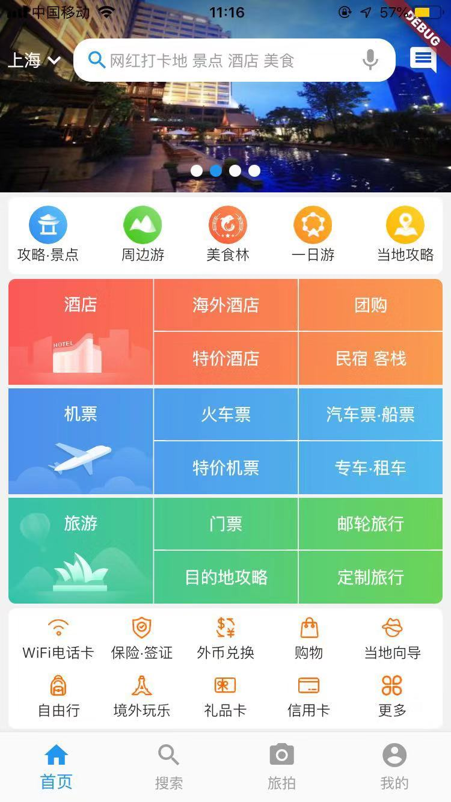
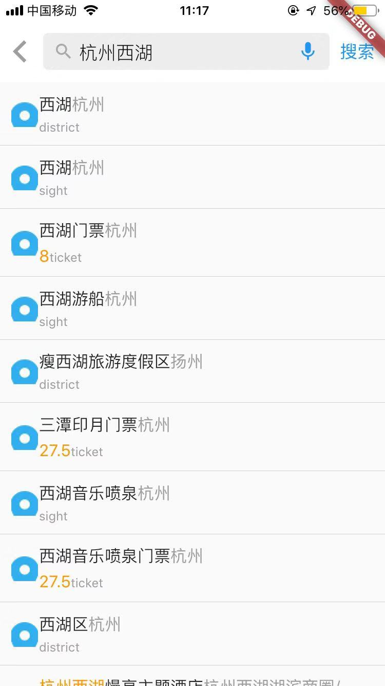
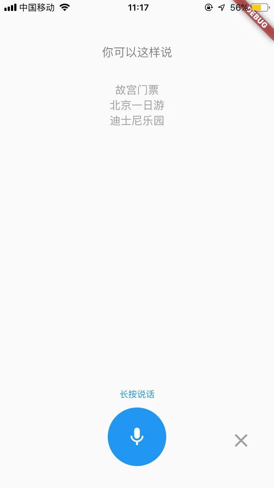

## 高仿携程网App
**flutter + h5页面**

#### 项目目录
--- lib  
----- dao        // interface     
----- json   
----- model      // model     
----- navigator  // 导航     
----- pages      // 页面文件  
----- widget     // 通用widget  
----- main.dart  //根文件 

#### 开发流程
- 创建model文件
    创建dart类型的model,工具：https://www.devio.org/io/tools/json-to-dart/
- 创建接口文件
    在dao里创建interface文件
    Utf8Decoder utf8decoder = Utf8Decoder();解决中文乱码问题
    Future类似Promise, 用法类似
- 页面布局
    在pages中创建page页面，搭建页面布局，抽离公共widget        

#### 如何结合h5页面
- 封装webview.dart

#### 项目插件
<a href='./doc/package.md'>插件文档 /doc/package.md</a>

#### 项目优化及打包发布流程
<a href='./doc/point.md'>文档说明 /doc/point.md</a>

#### 如何运行？

在项目根目录运行`flutter run`或用装有Flutter和Dart插件的IDE运行；

#### 项目预览

